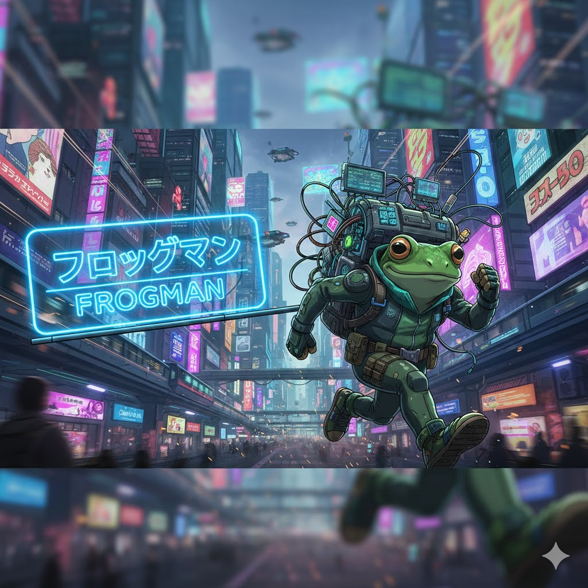

# Hi, I'm Salehin

Ex Jr. Pentester at Cyber Bangla and full time Bug Hunter.
Also an Amateur Astronomer, Farmer, Radio and Electronics Enthusiast

## Know Me

Just like other cyber security enthusiast, I also like to learn and explore new topics and techniques each and every day  
But what is special about me, or should I say, what I do better than other is sticking with a `unknown`/ `new` topic untill I learn it.  
Beside cyber security, I also like to work with the following things:
- Electornics/ Robotics 🤖
- Radio/ SDR 📡
- Astronomy 🔭

Currently working on:
- `Red Teaming` 🔴
- `Pentesting` 🧪
- `Reverse Engineering` 🤖

### Programming Languages
- 
- 
- 
- 
- 

### Prototyping Boards
- 
- 
- 

## Status

